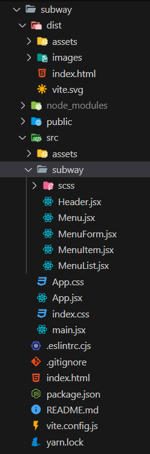
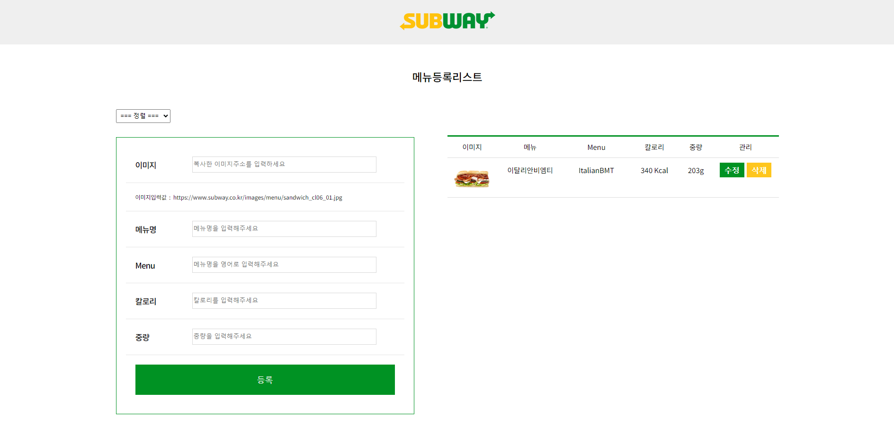

# 서브웨이 메뉴등록 싱글페이지 제작

 
 

## 프로젝트 참고 또는 리뉴얼 사이트

1. <a href="https://www.subway.co.kr/" target="_blank"> 서브웨이 </a>

## 사용 기술  

- [X] React
- [X] scss

### 파일 경로

## 프로젝트 주요 기능

1. 메뉴 등록
2. 메뉴 수정
3. 상품 정렬
   
## 프로젝트 작업 순서

1. 싱글페이지 선정
2. 등록 항목 설정

## 프로젝트 기능 구현
### 메뉴 등록하기

* 메뉴 이미지, 메뉴명, 영문 메뉴명, 칼로리, 중량 
* 상품 등록 폼 
* 등록한 상품 정렬 
  

